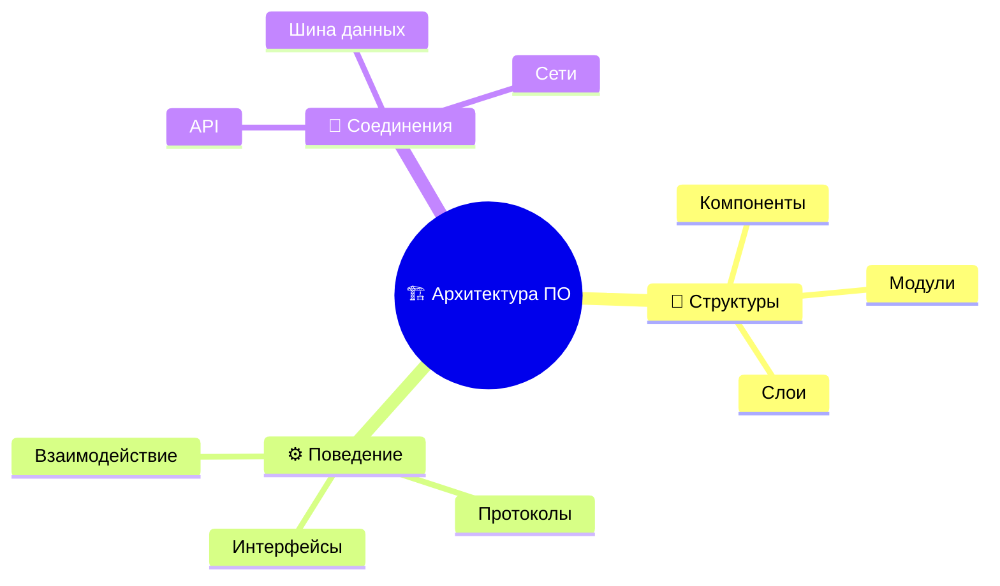
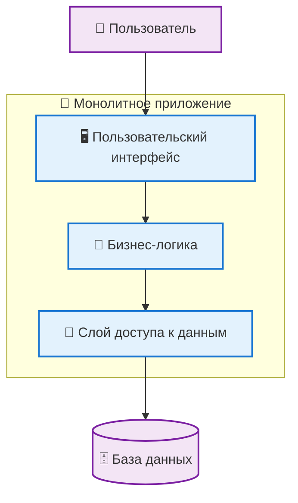
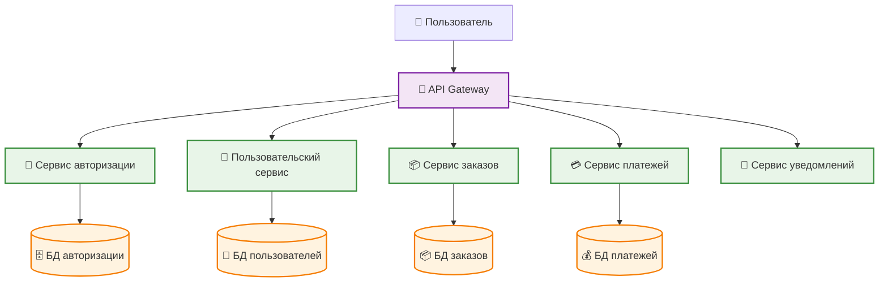
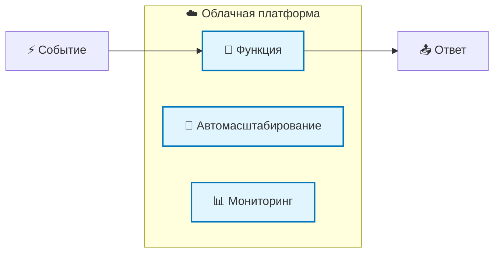
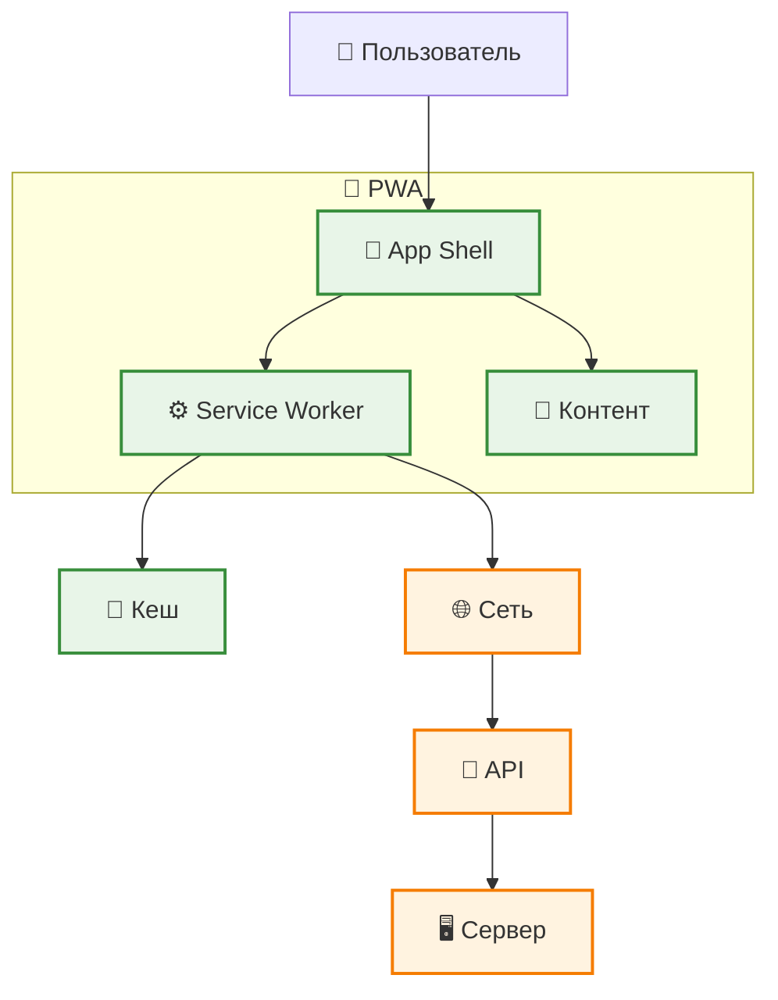

> См. также: [[Веб-разработка]] · MOC: [[MOC: Веб-разработка и архитектура]]

# 🏗️ Основные понятия разработки веб-приложений

> [!info]- О чём этот конспект Ключевые архитектурные подходы, паттерны и принципы современной разработки веб-приложений — от монолита до микросервисов.

---

## 🎯 Архитектура программного обеспечения

> [!abstract] Определение **Архитектура ПО** — совокупность важнейших решений об организации программной системы

### 🔧 Что включает архитектура:

> [!check] Ключевые элементы
> 
> - **Структуры** — архитектурные компоненты системы
> - **Поведение** — взаимодействие в рамках сотрудничества элементов
> - **Соединения** — связи между компонентами и их поведение

---

## 🌐 IT Архитектура

> [!note] IT Архитектура Специально подобранный набор структурных элементов, организованных определённым образом, образующий единый программный комплекс

---

## 📋 Архитектурные подходы

> [!tip] Архитектурный подход  
> Соглашения, принципы и практики для описания архитектуры в определённой предметной области конкретным сообществом

### 1️⃣ **Информационная архитектура**

> [!example]- Подробнее **Назначение:** Набор методик и инструментов для описания информационной модели
> 
> **Включает:**
> 
> - 🗄️ Базы данных
> - 📊 Информационные потоки
> - 📈 Модели данных

### 2️⃣ **Архитектура прикладных решений**

> [!example]- Подробнее **Назначение:** Совокупность программных продуктов и архитектурных приложений
> 
> **Включает:**
> 
> - 🔌 Интерфейсы между приложениями
> - 🧩 Программные компоненты
> - 🔄 Интеграционные решения

### 3️⃣ **Техническая архитектура**

> [!example]- Подробнее **Назначение:** Совокупность программных средств для эффективного функционирования приложений
> 
> **Включает:**
> 
> - 🖥️ Инфраструктуру предприятия
> - 💿 Системное ПО
> - 📡 Сетевые решения

### 4️⃣ **Дополнительные компоненты**

- 📜 **Стандарты** на программные средства
- 🔒 **Средства обеспечения безопасности**
- ⚙️ **Системы управления инфраструктурой**

### 5️⃣ **Бизнес-архитектура**

> [!success] Бизнес-архитектура Целевое построение предприятия согласно его миссии, стратегии и бизнес-целям

**В ходе построения определяются:**

- 🔄 Бизнес-процессы
- 📊 Информационные потоки
- 📦 Материальные потоки
- 👥 Штатная структура

---

## 🌐 Архитектуры веб-приложений

### 📱 SPA (Single Page Application)

> [!info] SPA — одностраничное приложение Введено для достижения плавной работы приложения и интуитивно понятного интерфейса для пользователя

**🎯 Принцип работы:**

- Загружает одну HTML-страницу
- Работает через DOM-манипуляции
- Выполняется на стороне клиента
- Использует JavaScript-фреймворки

#### ⚠️ **Недостатки SPA:**

> [!warning] Ограничения SPA
> 
> - 🎯 **SEO:** меньше возможностей таргетирования для разных запросов
> - 🔍 **Индексация:** проблемы с индексацией динамического контента
> - 📊 **Аналитика:** сложности с аналитикой посещаемости
> - 🔗 **Навигация:** не сохраняет историю по страницам
> - 📤 **Шаринг:** нельзя делиться ссылкой на определённые страницы
> - 🧭 **UI:** не поддерживает стандартные навигационные панели
> - 🔒 **Безопасность:** требует дополнительных мер защиты
> - ⏱️ **Загрузка:** первоначальная загрузка занимает больше времени

---

### 🏢 Монолитная архитектура

> [!abstract] Монолит Архитектура, построенная как единое целое, где вся логика помещается внутри одного процесса

#### ✅ **Преимущества:**

- 🚀 Простота разработки и развертывания
- 🔧 Легкое тестирование
- 📦 Единый пакет для деплоя

#### ❌ **Недостатки:**

- 📈 Сложность масштабирования
- 🔄 Сложность внесения изменений
- 🛠️ Ограничения технологий

---

### 🧩 Микросервисная архитектура

> [!success] Микросервисы Набор небольших и слабо связанных компонентов, которые можно разрабатывать, развертывать и поддерживать независимо друг от друга

#### ✅ **Преимущества:**

- 🔄 Независимая разработка и развертывание
- 📈 Горизонтальное масштабирование
- 🛠️ Свобода выбора технологий
- 🎯 Специализация команд

#### ❌ **Недостатки:**

- 🌐 Сложность сетевого взаимодействия
- 📊 Сложность мониторинга
- 🔄 Управление распределенными транзакциями

---

### ☁️ Бессерверная архитектура (Serverless)

> [!note] Serverless Облачная модель разработки, где приложения создаются и запускаются без ручного управления инфраструктурой

**🔄 Типы бессерверных решений:**

#### 1️⃣ **BaaS (Backend-as-a-Service)**

> [!example]- Backend как сервис
> 
> - 🗄️ Управляемые базы данных
> - 🔐 Сервисы аутентификации
> - 📧 Push-уведомления
> - 📁 Файловое хранилище

#### 2️⃣ **FaaS (Function-as-a-Service)**

> [!example]- Функции как сервис
> 
> - ⚡ AWS Lambda
> - 🔵 Azure Functions
> - 🟢 Google Cloud Functions
> - ⚙️ Выполнение кода по событиям

---

### 📱 Progressive Web Apps (PWA)

> [!tip] Прогрессивные веб-приложения Веб-приложения, которые используют современные возможности браузеров для обеспечения app-like опыта

#### 🎯 **Основные преимущества:**

> [!success] Ключевые возможности PWA
> 
> - 📱 **Offline работа** — функционирует без интернета
> - ⚡ **Быстрая загрузка** — кеширование ресурсов
> - 🔔 **Push-уведомления** — как у нативных приложений
> - 📲 **Установка** — можно установить на домашний экран
> - 🔒 **Безопасность** — работает только по HTTPS

#### 🏗️ **Архитектура PWA:**

**🔄 Два потока информации:**

1. **📄 Статика** — App Shell, стили, скрипты
2. **🔗 API** — Динамические данные от сервера

---

## 🗺️ Сравнение архитектур

|Характеристика|🏢 Монолит|🧩 Микросервисы|☁️ Serverless|📱 PWA|
|---|---|---|---|---|
|**Сложность разработки**|🟢 Низкая|🔴 Высокая|🟡 Средняя|🟡 Средняя|
|**Масштабируемость**|🔴 Ограничена|🟢 Отличная|🟢 Автоматическая|🟡 Хорошая|
|**Скорость разработки**|🟢 Быстрая|🔴 Медленная|🟢 Быстрая|🟡 Средняя|
|**Производительность**|🟢 Высокая|🟡 Зависит|🟡 Переменная|🟢 Высокая|
|**Управление**|🟢 Простое|🔴 Сложное|🟢 Упрощенное|🟡 Среднее|

